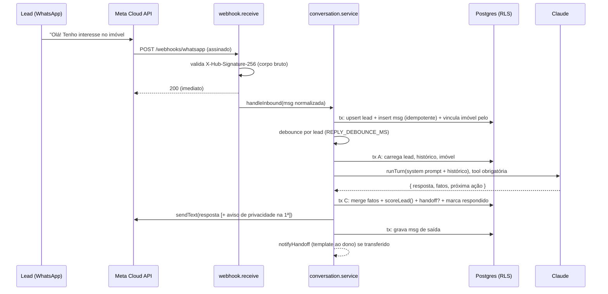
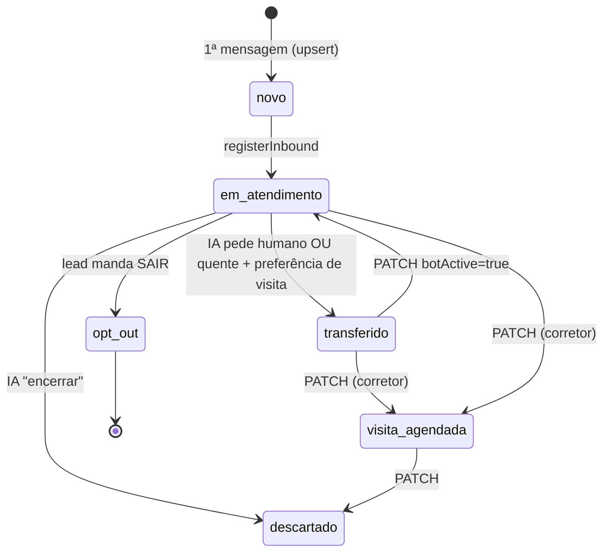

# Atendimento WhatsApp com IA: lógica, integridade e fluxo

Fonte analisada: `src/controllers/index.js`, `src/services/conversation.service.js`, `src/services/scoring.js`, `src/services/ai/*.js`, `src/services/whatsapp/*.js`, `src/services/property.service.js`, `src/jobs/followUp.job.js`, `src/db/migrations/0001_init.js` · Gerado em: 24/09/2026

## 1. Propósito

O interessado vê o imóvel (no Marketplace, Instagram, OLX etc.) e clica num link. Esse link abre o WhatsApp da imobiliária com uma mensagem já escrita, contendo o código do imóvel (`#CASA01`). A partir daí, o sistema:

1. recebe a mensagem pelo webhook da WhatsApp Cloud API;
2. conversa com o lead usando o Claude, com base nos dados cadastrados do imóvel;
3. extrai fatos de qualificação (renda, garantia, moradores, pet, prazo e interesse em visita);
4. **calcula a classificação no backend** (quente, morno, frio ou indefinido);
5. transfere para um humano quando o lead está pronto para visitar ou pede atendimento;
6. mede o funil: cliques → conversas → qualificados → visitas.

## 2. Fluxo

### Sequência de uma mensagem

### Máquina de estados do lead (`aim_lead.status`)

`opt_out` é final: `lead.service.update` recusa qualquer alteração (409) e o webhook ignora novas mensagens.

## 3. Passo a passo

### Passo 1: `webhook.receive` (`src/controllers/index.js:108`)
- **Entrada:** corpo **bruto** (`express.raw`) e header `x-hub-signature-256`.
- **Lógica:** se `isValidSignature` falha, responde 401. Se o JSON é inválido, 400. Caso contrário, responde **200 antes** de processar (a Meta reenvia se demorar) e processa as mensagens em sequência.
- **Efeitos:** nenhum antes do 200.
- **Invariante:** nada é gravado sem assinatura válida.
- **🧪 Teste:** `integration.test.js` › "assinatura inválida = 401 e nada é gravado".

### Passo 2: `isValidSignature` (`src/services/whatsapp/signature.js:10`)
- **Lógica:** `esperado = HMAC_SHA256(WA_APP_SECRET, corpo_bruto)` em hex; compara com `timingSafeEqual`. Rejeita algoritmo diferente de `sha256`, hex malformado e corpo que não seja `Buffer`.
- **🧪 Teste:** `unit.test.js` › "assinatura do webhook" (5 casos).

### Passo 3: `parseWebhook` / `extractPropertyCode` (`src/services/whatsapp/webhookParser.js:24`, `:57`)
- **Saída:** `[{ phoneNumberId, waMessageId, waId, name, type, text, referralSource }]`. Ignora `statuses` e remetentes que não sejam 8 a 15 dígitos. Texto é truncado em 4000 caracteres.
- **Código do imóvel:** regex `#([A-Za-z0-9]{3,12})`, convertido para maiúsculas.
- **🧪 Teste:** `unit.test.js` › "parser do webhook".

### Passo 4: `registerInbound` (`src/services/conversation.service.js:42`)
- **Entrada:** mensagem normalizada.
- **Lógica:**
  1. Resolve o tenant por `wa_phone_number_id` (tabela `aim_tenant`, sem RLS e só leitura para `aim_app`). Se o número for desconhecido, só loga.
  2. Numa transação com tenant (`inTx`):
     - faz `INSERT … ON CONFLICT (tenant_id, wa_id)` do lead, sem corrida;
     - faz `INSERT` da mensagem com `ON CONFLICT (tenant_id, wa_message_id) DO NOTHING`. Se nada foi inserido, é duplicata e a ação vira `ignore`;
     - trava o lead (`FOR UPDATE`), atualiza `last_inbound_at`, zera `followup_count` e muda `novo` para `em_atendimento`;
     - se houver `#CODIGO` e o lead ainda não tiver imóvel, vincula o imóvel ativo com esse código.
  3. Decide a ação, nesta ordem:
     - status `opt_out` ou `descartado` → `ignore`;
     - texto de opt-out → `opt_out` (grava `opt_out_at` e `bot_active=false`);
     - `bot_active=false` → `ignore`;
     - texto vazio (áudio, imagem) → `unsupported`;
     - nos demais casos → `reply`.
- **Invariantes:** uma mensagem da Meta equivale a no máximo uma linha em `aim_message`. Há um lead por `(tenant, telefone)`.
- **🧪 Teste:** integração › "lead qualificado…" (reenvio do mesmo wamid não duplica) e "SAIR = opt-out".

### Passo 5: `scheduleReply` / `runReply` (`:156`, `:167`)
- **Lógica:** debounce em memória por lead. Cada mensagem nova reinicia o timer. Se já houver uma resposta em andamento, marca `pending` e roda de novo ao terminar. Resultado: 3 mensagens seguidas geram **1** chamada à IA com as 3 no histórico.
- **Limite:** estado em memória, então vale para **uma instância** só (ver §6).
- **🧪 Teste:** integração › "mensagens em sequência geram UMA resposta".

### Passo 6: `processReply` (`:185`)
- **A) Contexto (tx curta):** aborta se o bot estiver desligado, se o status for `opt_out`, `descartado` ou `transferido`, se a última mensagem recebida já foi respondida (`created_at <= last_replied_inbound_at`) ou se passou da janela de 24h. Carrega as últimas `HISTORY_MAX_MESSAGES` mensagens, o imóvel e até 20 imóveis ativos. Sem imóvel, os ativos vão ao prompt para a IA descobrir qual o lead quer; com imóvel, viram **alternativas** via `findAlternatives(qualification, ativos, imóvel atual)` (Passo 7b).
- **B) IA (fora de transação):** `buildSystemPrompt` + `runTurn`.
- **C) Aplicação (tx, lead travado):**
  - se um humano desligou o bot enquanto a IA pensava, descarta a resposta;
  - **vínculo/troca de imóvel:** se `codigo_imovel` veio preenchido e é diferente do imóvel atual, procura um imóvel ativo com esse código; se existir, o lead passa a ser desse imóvel (cobre o primeiro vínculo e a aceitação de uma alternativa). Código inexistente ou inativo não muda nada;
  - `qualification = mergeQualification(atual, fatos_novos)`, sem apagar fato já conhecido;
  - `scoreLead(qualification, imóvel)` (Passo 7), já contra o imóvel novo se houve troca;
  - `open_questions = mergeOpenQuestions(atuais, duvidas_sem_resposta)`: normaliza espaços, ignora repetidas (sem diferenciar maiúsculas) e itens com menos de 3 caracteres, guarda as 10 mais recentes;
  - **handoff** se `proxima_acao = transferir_humano` **ou** (`classificação = quente` **e** há preferência de visita): muda para `status=transferido` e `bot_active=false` e grava `handoff_at`/`handoff_reason`, e `handoff_summary` = `resumo_para_corretor` da IA ou, se vier vazio, `describeQualification(...)` (resumo determinístico: nome, imóvel, classificação, fatos e visita), limitado a 1000 caracteres;
  - `encerrar` muda para `status=descartado` e `bot_active=false`;
  - na 1ª resposta, anexa o aviso de privacidade com opção SAIR e grava `privacy_notice_sent_at`;
  - grava `last_replied_inbound_at = created_at` da última mensagem considerada.
- **D) Envio:** `sendAndRecord`. **Se o envio falhar**, restaura `last_replied_inbound_at` e `privacy_notice_sent_at` anteriores para que a recuperação tente de novo; a classificação é mantida.
- **E)** `notifyHandoff` se houve transferência. Uma falha aqui só é logada.
- **🧪 Teste:** integração › "lead qualificado vira quente e é transferido", "falha no envio… desfaz respondido".

### Passo 7: `scoreLead` (`src/services/scoring.js:31`), classificação no backend
A IA **não** classifica: ela só extrai fatos, e esta função pura decide. Com `custo_mensal = price_cents + fees_cents`:

| Regra | Condição | Efeito |
|---|---|---|
| Renda (só aluguel) | `renda / custo_mensal < 2,5` | desqualifica: `renda_insuficiente` |
| | `≥ 3,0` | +30 |
| | entre 2,5 e 3,0 | +15 |
| Garantia (só aluguel) | aceita, ou imóvel sem lista | +20; senão `garantia_nao_aceita` |
| Pet | tem pet e imóvel não aceita | `pet_nao_permitido`; senão +5 |
| Moradores | `> max_occupants` | `moradores_acima_limite`; senão +5 |
| Prazo de mudança | `≤ 30 dias` / `≤ 60 dias` | +20 / +10 |
| Quer visitar | `true` | +20 |

**Classificação**, avaliada nesta ordem:

1. qualquer motivo de desqualificação → **frio**;
2. `score ≥ 70` → **quente**;
3. menos de 3 dos 5 fatos-chave conhecidos → **indefinido** (ainda qualificando);
4. `score ≥ 40` → **morno**;
5. nos demais casos → **frio**.

Sem imóvel definido, o resultado é **indefinido**.

- **Exemplo (teste):** aluguel de R$ 2.000 + R$ 150 e renda de R$ 8.000 (3,72x) dão 30. Com garantia caução (+20), sem pet (+5), 2 moradores (+5), mudança em 20 dias (+20) e interesse em visitar (+20), o score é **100 → quente**.
- **🧪 Teste:** `unit.test.js` › "scoring" (13 casos, incluindo os limites 2,5x, 3x, 30/60/61 dias).

### Passo 7b: alternativas, dúvidas sem resposta e resumo (`src/services/scoring.js`, funções puras)
- **`findAlternatives(qualification, imóveis, idAtual, max = 3)`:** descarta o imóvel atual e os inativos, roda `scoreLead` da qualificação **atual** contra cada um, mantém só os sem motivo de desqualificação e ordena por score (desc) e preço (asc). Como usa os fatos de antes da rodada, a lista fica uma rodada atrasada em relação ao que o lead acabou de dizer; a IA compensa lendo a mensagem, e na rodada seguinte a lista já reflete os fatos novos.
- **`mergeOpenQuestions(atuais, novas)`:** ver Passo 6 C. Duplicata semântica ("Tem academia?" e "O prédio tem academia?") não é detectada; o prompt recebe `<duvidas_ja_registradas>` para a IA não repetir.
- **`describeQualification({ name, property, qualification, visitPreference, classification })`:** monta uma frase por bloco ("Ana: interesse em #CASA01 (Casa), classificação quente. Informou: renda R$ 7.500,00, garantia caução, 3 moradores, tem pet. Quer visitar: sábado de manhã."). Também é usada em `lead.service.update` quando o corretor marca `transferido` pelo painel sem resumo.
- **Agregação por imóvel:** `property.service.openQuestions` (`GET /api/v1/properties/:id/open-questions`) faz `jsonb_array_elements_text(open_questions)` dos leads do imóvel, agrupa por `lower(pergunta)` e devolve `{ question, leads, lastAskedAt }` ordenado por quantidade de leads. Roda em `inTx` (RLS) depois de `get()` garantir que o imóvel é da conta.
- **🧪 Teste:** `unit.test.js` › "alternativas, dúvidas e resumo" (5 casos); integração › "dúvidas sem resposta ficam no lead e agregadas por imóvel" e "lead aceita a alternativa".

### Passo 8: `runTurn` (`src/services/ai/claude.client.js:99`)
- **Lógica:** o histórico vira mensagens alternadas `user`/`assistant`, começando por `user` (`toClaudeMessages`). A chamada força `tool_choice` em `registrar_atendimento`. A saída é **não confiável** e passa por validação Zod (`outputSchema`): tamanhos, enums, inteiros e faixas. Em seguida, `toInternal` converte a renda de reais para centavos com `Math.round(x*100)`.
- **Erros:** `AI_INVALID_OUTPUT` (502) quando o formato é inválido; `AI_NOTHING_TO_ANSWER` quando a última mensagem não é do lead.
- **🧪 Teste:** `unit.test.js` › "cliente da IA".

### Passo 9: job periódico (`src/jobs/followUp.job.js:44`)
1. **`recoverUnanswered`** (`conversation.service.js:296`) procura leads ativos com mensagem recebida sem resposta, entre 1 minuto e 2 horas atrás, e reagenda a resposta. Isso cobre reinício do processo, falha da IA e falha de envio.
2. **Follow-up:** um `UPDATE … RETURNING` atômico reivindica leads que:
   - estão `em_atendimento` com bot ligado e `followup_count = 0`;
   - tiveram a última mensagem enviada por nós há mais de `FOLLOWUP_AFTER_MINUTES`;
   - mandaram a última mensagem há menos de 23h.

   Cada lead recebe **uma** mensagem de retomada. Fora da janela de 24h não há envio, porque exigiria template.
- **🧪 Teste:** verificado com dois leads, um dentro e outro fora da janela: só o de dentro foi reivindicado.

### Passo 10: link rastreado (`property.service.js:68`, `controllers/index.js:137`)
- `GET /r/:slug/:code?src=marketplace` registra `aim_link_click` (sem IP nem user-agent) e responde 302 para `https://wa.me/<numero>?text=Olá! Tenho interesse no imóvel #CODIGO (...)`.
- **🧪 Teste:** integração › "clique no link rastreado conta e redireciona".

## 4. Integridade das partes

### Contratos

| Produz | Consome | Formato | Quebra se… |
|---|---|---|---|
| `parseWebhook` | `registerInbound` | `{ phoneNumberId, waMessageId, waId, name, type, text, referralSource }` | a Meta mudar o payload (versão da Graph API) |
| `buildWaLink` | `extractPropertyCode` | texto com `#CODIGO` | alguém mudar o texto do link sem manter o `#` |
| `runTurn` (via `toInternal`) | `processReply` | `{ reply, facts{monthlyIncomeCents,…}, propertyCode, visitPreference, nextAction, handoffReason, handoffSummary, openQuestions[] }` | renomear campo da tool sem atualizar `outputSchema`/`toInternal`. Campos novos ausentes viram `null`/`[]` |
| `findAlternatives` | `buildSystemPrompt` (`<outros_imoveis_compativeis>`) | lista de imóveis planos `{ code, title, locationSummary, priceCents, dealType }` | mudar o formato do imóvel plano |
| `aim_lead.open_questions` (jsonb) | serializer `lead`, `property.service.openQuestions` | array de strings | gravar objeto em vez de string quebra o `jsonb_array_elements_text` |
| `scoreLead` | `aim_lead` / serializer | `{ score, classification, disqualifyReasons }` | adicionar classificação sem atualizar o CHECK da migration e o schema `leadList` |
| `aim_lead.qualification` (jsonb) | serializer `lead` | chaves camelCase de `KEY_FACTS` + `wantsVisit` | renomear chave: leads antigos ficam com o campo vazio |

### Invariantes globais
- Toda query de tabela com `tenant_id` roda dentro de `inTx(tenantId)`. Sem isso, o RLS devolve 0 linhas, falhando de forma fechada.
- `tenant_id` nunca vem do body: vem do JWT, do `phone_number_id` do webhook assinado ou do slug do link público.
- Nenhuma chamada de rede (Meta/Anthropic) acontece dentro de transação.
- Classificação e taxas do funil são sempre calculadas no backend.
- Lead em `opt_out` nunca recebe mensagem, nem de humano.

### Matriz de impacto

| Mudança | Revalidar |
|---|---|
| Regras/pesos do `scoreLead` | `unit.test.js` › scoring, prompt (o que a IA pergunta), métricas |
| Campos da tool da IA | `TOOL`, `outputSchema`, `toInternal`, prompt, testes da IA |
| Status do lead | CHECK da migration, schemas `leadList`/`leadUpdate`, `processReply`, job, diagrama acima |
| Texto do link wa.me | `extractPropertyCode`, teste do link |
| `WA_GRAPH_VERSION` | `parseWebhook` e `client.js` contra a doc da Meta |

## 5. Plano de teste por passo

| Passo | Nível | Cenário (sem dados reais) | Esperado |
|---|---|---|---|
| Assinatura | lógica | corpo alterado ou secret errado | `false` |
| Idempotência | sistema | mesmo `wamid` enviado duas vezes | 1 mensagem gravada |
| Debounce | sistema | 3 mensagens seguidas | 1 chamada à IA com 3 mensagens |
| Classificação | lógica | limites 2,5x/3x, 30/60/61 dias, pet proibido | tabela do Passo 7 |
| Handoff | integrado | IA retorna fatos completos + preferência | `transferido`, bot desligado, `handoff_summary` preenchido |
| Alternativas | lógica | lead com pet e 2 moradores; imóveis sem pet, com limite 1 morador e inativo | só os compatíveis, ordenados por score |
| Troca de imóvel | integrado | IA devolve código de outro imóvel ativo; depois um inexistente | `property_id` troca; depois não muda |
| Dúvidas | integrado | IA devolve `openQuestions` | gravadas no lead e agregadas em `/properties/:id/open-questions` |
| Falha de envio | integrado | `sendText` rejeita | `last_replied_inbound_at` volta para null e a nova tentativa responde |
| Opt-out | integrado | "SAIR" e depois "oi" | `opt_out`, IA não é chamada |
| Multi-tenant | sistema | conta B lista leads e abre lead da conta A | 0 itens / 404 |
| Refresh | sistema | reusar refresh já rotacionado | 401 e todas as sessões revogadas |

Para rodar: `npm test` roda os unitários. Com Postgres de **teste**, `npm run migrate && npm run seed:dev && TEST_DB=1 npm test`. WhatsApp e Anthropic são mockados.

## 6. Pontos em aberto e limitações do MVP
- **Dúvidas sem resposta são por lead, não por imóvel:** a agregação usa o imóvel **atual** do lead. Se o lead perguntou sobre a kitnet e depois trocou para a casa, a pergunta aparece na casa. Para atribuir por imóvel seria preciso gravar `{ pergunta, codigo_imovel }` e a IA indicar o código em cada dúvida.
- **Alternativas com uma rodada de atraso:** `findAlternatives` usa os fatos de antes da rodada (ver Passo 7b). Na primeira mensagem a lista pode incluir imóvel incompatível com o que o lead acabou de dizer; a IA lê a mensagem e filtra, e na rodada seguinte a lista já está correta.
- **Troca de imóvel confia na IA:** o backend só valida que o código existe e está ativo. Se a IA preencher `codigo_imovel` com uma alternativa apenas oferecida (não aceita), o lead troca de imóvel. O prompt proíbe isso; o painel mostra o imóvel na ficha para o corretor corrigir.
- **Agendamento de visita (25/09/2026):** com grade de horários na conta, a assistente marca a visita num horário livre, e o lead fica `visita_agendada` com o bot ligado. A regra "quente com preferência de visita vai para o corretor" passou a valer só quando não há horários para oferecer. Ver `docs/logica/rotina-do-dono.md`.
- **Fila de jobs (resolvido em 25/09/2026):** o debounce em memória e o processamento depois do 200 foram trocados pela fila `aim_job`. A mensagem é gravada antes do 200, e o sistema aguenta várias instâncias. Ver `docs/logica/fila-jobs.md`. Onde este documento fala em `scheduleReply`, `runReply` ou timers, vale a fila.
- **Fatos podem ser mentira:** a IA registra o que o lead declara. A classificação filtra quem é compatível, mas não verifica renda. Quem valida é o corretor.
- **Relógio:** mensagens recebidas usam `now()` do banco e as enviadas usam a hora da aplicação. Com relógios dessincronizados, a ordem do histórico pode inverter por milissegundos.
- **Token WhatsApp por conta (resolvido em 25/09/2026):** cada conta pode ter o próprio token, cifrado com AES-256-GCM. O `WA_ACCESS_TOKEN` global vale só para conta sem token. Ver `docs/logica/fila-jobs.md`, passos 9 a 11.
- **LGPD (resolvido em 25/09/2026):** existem retenção automática, exportação e exclusão a pedido do titular, exclusão da conta e rascunhos de política de privacidade, aviso ao lead e termos. Os textos citam o envio das conversas à Anthropic, nos EUA. Ver `docs/lgpd/inventario.md`. Ficam em aberto a correção de dados do lead e a retenção de logs e backups.
- **Padrões WPX:** este código foi escrito a partir do resumo das regras (a pasta `wpx-padroes` não foi lida). Conferir com `01`, `03`, `05` e `06` antes de subir para produção.
