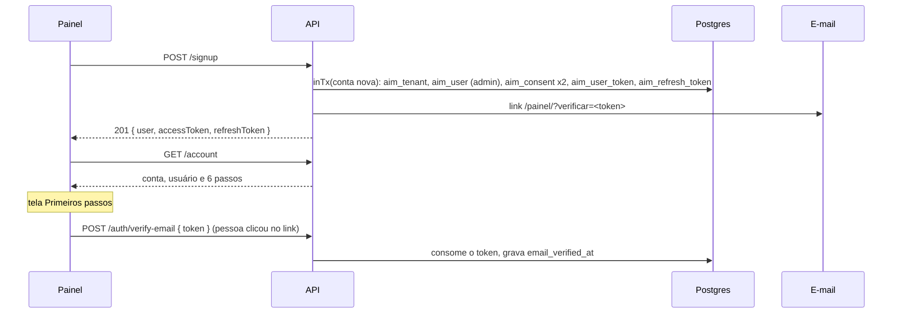
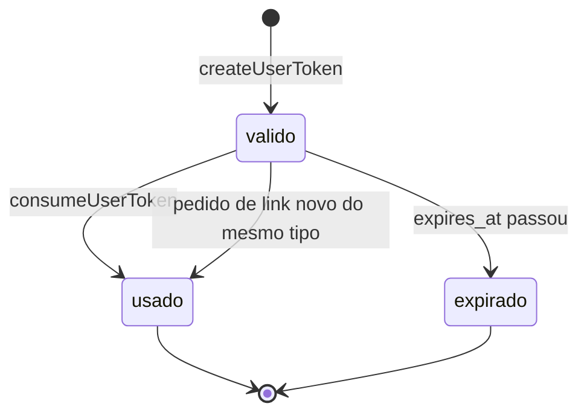

# Cadastro sozinho, confirmação de e-mail e primeiros passos: lógica, integridade e fluxo

Fonte analisada: `src/db/migrations/0006_cadastro_conta.js`, `src/services/account.service.js`, `src/services/email.service.js`, `src/config/legal.js`, `src/controllers/index.js` (objeto `account`), `src/routes/index.js`, `src/schemas/index.js`, `src/serializers/index.js`, `public/painel/app.js` e `index.html` · Gerado em: 25/09/2026

Item 1.1 do plano em `docs/plano/melhorias-produto-simples.md`.

## 1. Propósito

Uma imobiliária ou um corretor cria a conta pelo painel, sem ajuda, e sai usando:

1. informa nome da imobiliária, endereço da conta, nome, e-mail e senha, e aceita os termos;
2. a conta e o primeiro admin nascem juntos, e a pessoa já entra logada;
3. um e-mail com link de uso único confirma o endereço;
4. a tela "Primeiros passos" guia até a primeira conversa: imóvel, WhatsApp, link do anúncio e teste;
5. quem esquece a senha recebe um link para criar outra.

## 2. Fluxo

### Estados de um link de uso único (`aim_user_token`)

## 3. Passo a passo

### Passo 1: `signup` (`src/services/account.service.js:99`)
- **Entrada:** `{ accountName, slug, name, email, password, acceptTerms: true }`, validada pelo schema `signup`. O schema é `.strict()`, então `tenantId` ou outro campo extra é recusado com 422.
- **Validações:**
  - `slug` com 3 a 40 caracteres, minúsculas, números e hífen, começando e terminando com letra ou número;
  - senha com pelo menos 10 caracteres;
  - `acceptTerms` precisa ser literalmente `true`;
  - endereço reservado, como `admin`, `api` ou `painel`, gera 409.
- **Lógica:** gera o id da conta no app e abre `inTx` com ele, antes de a conta existir. Assim a policy `aim_tenant_insert_own` aceita o INSERT, porque o id é igual ao do contexto. Na mesma transação grava:
  - a conta, com `id`, `slug` e `name`;
  - o usuário admin, com e-mail em minúsculas e senha com bcrypt custo 12;
  - dois aceites, `termos` e `privacidade`, com as versões de `config/legal.js`;
  - o link de confirmação, válido por 48 horas;
  - a sessão, com os tokens de acesso e de renovação.
- **Erros:** endereço repetido gera `SequelizeUniqueConstraintError`, convertido em 409 `SLUG_TAKEN`.
- **Depois da transação:** envia o e-mail. Uma falha no envio só gera log, e a pessoa pode pedir de novo.
- **🧪 Teste:** integração › "cadastro sozinho" › "cria conta, admin, aceite e link de confirmação" e "endereço repetido, reservado, sem aceite ou senha curta são recusados".

### Passo 2: links de uso único (`newToken`, `parseToken`, `createUserToken`, `consumeUserToken`, linhas 38 a 71)
- **Formato:** `<id da conta>.<32 bytes aleatórios em base64url>`. O id da conta diz em qual contexto de RLS procurar. O banco guarda só `sha256(token inteiro)`.
- **createUserToken:** marca como usados os links anteriores do mesmo tipo e do mesmo usuário, e cria o novo com `expires_at = now() + validade`.
- **consumeUserToken:** `SELECT … FOR UPDATE` do link com o hash, o tipo certo, ainda não usado e dentro da validade. Marca como usado e devolve o usuário. Em qualquer outro caso devolve `null`.
- **Invariantes:**
  - um link vale uma vez só, e dois cliques simultâneos não passam os dois, por causa do `FOR UPDATE`;
  - quem lê o banco não consegue montar o link.
- **Validade:** confirmação de e-mail 48 horas, redefinição de senha 1 hora.

### Passo 3: `verifyEmail` (`:134`) e `resendVerification` (`:150`)
- **verifyEmail:** token malformado gera 400 `TOKEN_INVALID`. Senão consome o link e grava `email_verified_at`, só se ainda estiver vazio.
- **resendVerification:** e-mail já confirmado devolve `{ alreadyVerified: true }` sem enviar nada. Senão cria um link novo, o que invalida o anterior, e envia.
- **🧪 Teste:** integração › "confirma o e-mail pelo link; o link não vale duas vezes".

### Passo 4: `forgotPassword` (`:167`) e `resetPassword` (`:184`)
- **forgotPassword:** conta inexistente, e-mail inexistente ou usuário inativo terminam em silêncio. A rota responde sempre 202, e a resposta não revela quem tem cadastro. O e-mail é comparado sem diferenciar maiúsculas.
- **resetPassword:** calcula o hash da senha nova antes da transação, consome o link, troca a senha, confirma o e-mail e revoga todos os tokens de renovação do usuário.
- **🧪 Teste:** integração › "esqueci a senha: mesma resposta para quem existe e quem não existe" e "redefine a senha, encerra as sessões e o link não vale duas vezes".

### Passo 5: `getAccount` (`:203`) e `markOnboardingStep` (`:224`)
- **Passos, na ordem, e quando contam como feitos:**

| Passo | Feito quando |
|---|---|
| `conta` | sempre |
| `email` | `email_verified_at` preenchido |
| `imovel` | a conta tem pelo menos um imóvel |
| `whatsapp` | `wa_phone_number_id` preenchido |
| `link` | `onboarding.link_copiado` existe |
| `teste` | existe algum lead, ou `onboarding.teste_feito` |

- **Regra:** cinco dos seis passos são deduzidos do estado real. Só copiar o link e testar dependem de marcação explícita, porque o servidor não os vê acontecer.
- **markOnboardingStep:** aceita só `link` e `teste`. Faz `onboarding || {chave: now()}` apenas se a chave ainda não existe, então é idempotente.
- **🧪 Teste:** integração › "marca o passo do link; passo desconhecido é recusado".

### Passo 6: e-mail (`src/services/email.service.js`)
- **Com `EMAIL_PROVIDER=resend`:** envia pela API HTTP do Resend. Exige `RESEND_API_KEY`, e a subida falha sem ela.
- **Com `EMAIL_PROVIDER=log` fora de produção:** guarda as últimas 20 mensagens em memória. `GET /api/v1/dev/outbox` as lista, e o painel mostra a caixa de saída local com o botão "Abrir o link".
- **Com `EMAIL_PROVIDER=log` em produção:** não envia e registra um aviso sem o conteúdo.
- **Log:** nunca o corpo nem o e-mail completo, só no formato `a***@dominio`.

### Passo 7: painel (`public/painel/app.js`)
- **Telas públicas:** entrar, criar conta, esqueci a senha e nova senha. `#cadastro` e `#esqueci` no endereço abrem a tela direto, sem a entrada automática do modo local.
- **Endereço sugerido:** o endereço da conta é sugerido a partir do nome, sem acentos e com hífens, até a pessoa editar o campo.
- **Links do e-mail:** `?verificar=` e `?redefinir=` são lidos e apagados da URL na hora, com `history.replaceState`, para o token não ficar no histórico.
- **Depois de entrar:** com passos pendentes, abre "Primeiros passos", e o item aparece no menu. Com tudo feito, abre Leads e o item some.
- **Dependência:** "Copiar link" fica desabilitado até existirem imóvel e WhatsApp, porque a rota de links responde 409 sem número.

## 4. Integridade das partes

### Contratos

| Produz | Consome | Formato | Quebra se… |
|---|---|---|---|
| `account.service.getAccount` | `serialize.account` | `{ tenant, user, onboarding: { steps, completed } }` | mudar a chave de um passo: o painel usa as chaves em `passosDef` |
| `serialize.user` | painel e testes | `{ id, name, email, role, emailVerified }` | remover `emailVerified`: o aviso de confirmação some |
| link do e-mail | `tratarLinkDoEmail` no painel | `/painel/?verificar=<token>` ou `?redefinir=<token>` | mudar o nome do parâmetro de um lado só |
| `config/legal.js` | `aim_consent.version` | texto `^[a-z0-9.-]{1,40}$` | versão com maiúsculas ou espaço: o CHECK recusa e o cadastro falha |

### Invariantes globais
- `aim_tenant` tem RLS FORCE. A leitura é livre. INSERT e UPDATE só valem para a conta do contexto, e só nas colunas liberadas: `id`, `slug` e `name` no INSERT, `onboarding` e `updated_at` no UPDATE. O token do WhatsApp continua fora do alcance da aplicação.
- `aim_user_token` e `aim_consent` têm RLS FORCE por conta.
- O token de link existe só no e-mail e, por instantes, na URL do navegador.
- Trocar a senha encerra todas as sessões do usuário.

### Matriz de impacto

| Mudança | Revalidar |
|---|---|
| Novo passo do primeiro uso | `ONBOARDING_STEPS`, `getAccount`, `passosDef` no painel, teste de integração |
| Texto de termos ou privacidade | subir a versão em `config/legal.js` |
| Nova coluna gravável em `aim_tenant` pela aplicação | `GRANT UPDATE (coluna)` numa migration nova |
| Validade dos links | textos do e-mail, que dizem 48 horas e 1 hora |

## 5. Plano de teste

| Passo | Nível | Cenário | Esperado |
|---|---|---|---|
| signup | produto | cadastro completo | 201, conta, admin, 2 aceites, 1 link e sessão |
| signup | validação | endereço repetido, reservado, sem aceite, senha curta, campo extra | 409, 409, 422, 422 e 422, sem conta criada |
| verifyEmail | concorrência | mesmo link duas vezes | 200 e depois 400 |
| verifyEmail | segurança | token com os últimos caracteres trocados | 400 |
| forgotPassword | segurança | e-mail inexistente e conta inexistente | 202 sem e-mail enviado |
| resetPassword | sistema | troca de senha | login antigo 401, novo 200, renovação antiga 401 |
| RLS de `aim_tenant` | segurança | UPDATE em outra conta, INSERT com id diferente, gravar token | 0 linhas, erro de RLS, permissão negada |
| painel | sistema | roteiro no Chrome sem janela | cadastro, confirmação, imóvel, esqueci e nova senha funcionam sem erro de JavaScript |

## 6. Pontos em aberto
- **Termos de uso:** o link do cadastro aponta para `/termos`, página que nasce no item 1.5.
- **Conta sem e-mail confirmado:** ainda pode usar tudo. A trava prevista, "não conecta WhatsApp sem confirmar", entra junto com a conexão pelo painel, no item 1.2.
- **Sem proteção contra robô:** o cadastro tem só o limite de 10 por hora por IP. Se aparecer abuso, adicionar um desafio como o Turnstile.
- **Provedor de e-mail:** a integração com o Resend foi escrita pela documentação da API e não foi testada com uma chave real. Trocar de provedor mexe só em `sendViaResend`.
- **Caixa de saída local:** fica em memória e some quando a API reinicia.
