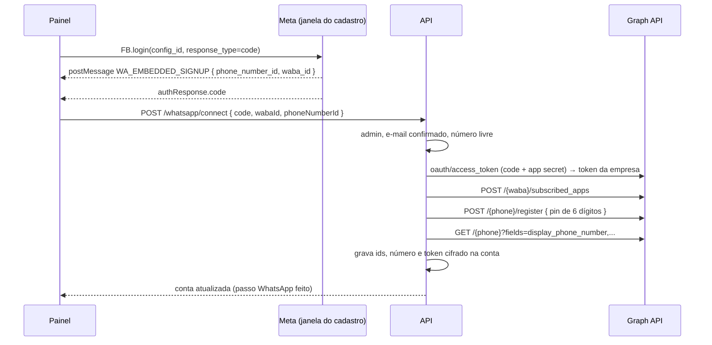

# Conectar o WhatsApp pelo painel (cadastro incorporado da Meta): lógica, integridade e fluxo

Fonte analisada: `src/db/migrations/0009_conexao_whatsapp.js`, `src/services/whatsappConnection.service.js`, `src/services/whatsapp/meta.js`, `src/app.js` (CSP), `src/config/env.js` (`META_APP_ID`, `META_ES_CONFIG_ID`), `public/painel/app.js` (`conectarWhatsapp`) · Gerado em: 25/09/2026

Item 1.2 do plano em `docs/plano/melhorias-produto-simples.md`.

> ⚠️ **Pré-requisito externo.** O app da Meta precisa estar aprovado como Tech Provider, com as permissões `whatsapp_business_management` e `whatsapp_business_messaging`, e ter uma configuração de "Login do Facebook para Empresas" do tipo cadastro incorporado do WhatsApp. Sem `META_APP_ID` e `META_ES_CONFIG_ID`, o botão não aparece e a rota responde 503. O fluxo foi testado com a API da Meta simulada. Falta rodar com o app real.

## 1. Propósito

O admin conecta o número da empresa sozinho, sem suporte: entra com o Facebook da empresa, escolhe ou cadastra o número e autoriza o Imobi. O sistema guarda o token daquela empresa cifrado, e o atendimento passa a usar esse número.

## 2. Fluxo

## 3. Passo a passo

### Passo 1: painel, `conectarWhatsapp` (`public/painel/app.js`)
- Só aparece para admin, com `whatsappSignup` presente em `GET /account`, o que significa app configurado. No "Primeiros passos", depende do e-mail confirmado.
- Carrega o SDK de `connect.facebook.net` uma única vez. A CSP libera esse domínio só quando o cadastro incorporado está configurado (`src/app.js`).
- Escuta `message` apenas de origens `*.facebook.com` e aceita só `type = WA_EMBEDDED_SIGNUP`. Com `CANCEL`, a conexão é tratada como cancelada.
- Espera até 2 segundos pela mensagem com o número depois do login. Sem código ou sem número, mostra que foi cancelado.

### Passo 2: `connect(tenantId, userId, { code, wabaId, phoneNumberId })` (`src/services/whatsappConnection.service.js`)
- **Entrada:** schema `whatsappConnect`, com `code` de 10 a 2000 caracteres e os dois ids só com dígitos. A rota exige admin e tem limite de 10 a cada 15 minutos.
- **Ordem**, com as chamadas de rede fora de transação:
  1. cadastro incorporado desligado gera 503; e-mail não confirmado gera 409;
  2. número já usado por outra conta gera 409 `WA_NUMBER_IN_USE`;
  3. troca o código pelo token com `client_id = META_APP_ID` e `client_secret = WA_APP_SECRET`;
  4. assina o app nos avisos da WABA;
  5. registra o número com um PIN aleatório de 6 dígitos;
  6. lê o número exibido, que precisa ter de 10 a 15 dígitos, ou dá 502;
  7. grava `wa_phone_number_id`, `wa_display_phone`, `wa_waba_id`, `wa_access_token_enc` e `wa_token_updated_at`. O índice único do número gera 409 numa corrida.
- **Falha da Meta em qualquer passo:** 502 `WA_CONNECT_FAILED`, sem gravar nada, e a conexão anterior continua valendo.
- **🧪 Teste:** integração › "conectar o WhatsApp pelo painel" › "conecta…" e "número de outra conta é recusado; falha da Meta não grava nada".

### Passo 3: `status` e `disconnect`
- **status:** sem número, `{ connected: false, signupAvailable }`. Com número, consulta a Meta ao vivo para nome, qualidade e limite de mensagens. Se a Meta falhar, devolve o que está gravado, com `live: false`. `ownToken` diz se a conta tem token próprio. O botão "Desconectar" só aparece nesse caso.
- **disconnect:** tenta tirar a assinatura dos avisos da WABA. Uma falha só gera aviso no log. Depois apaga número, ids e token da conta. Sem número, a conta não recebe mais mensagens: o webhook não acha a conta, e o passo "WhatsApp" volta a pendente.
- **🧪 Teste:** integração › "desconecta: tira a assinatura dos avisos e apaga número, ids e token" e "corretor não conecta nem desconecta".

## 4. Integridade das partes

| Produz | Consome | Formato | Quebra se… |
|---|---|---|---|
| Janela da Meta | painel | `{ type: 'WA_EMBEDDED_SIGNUP', event, data: { phone_number_id, waba_id } }` | a Meta mudar a versão da mensagem: ajustar `sessionInfoVersion` e a leitura |
| `connect` | `whatsapp/client.accessTokenFor` | `wa_access_token_enc` cifrado com o id da conta | trocar `WA_TOKEN_ENC_KEY` sem gravar os tokens de novo |
| `wa_phone_number_id` | webhook (`acceptInbound`) | só dígitos, único entre contas | - |
| `wa_display_phone` | link do anúncio (`wa.me/<número>`) | 10 a 15 dígitos | - |

**Invariantes:**
- A aplicação grava os campos do WhatsApp só da própria conta. Isso vem da policy `aim_tenant_update_own` somada ao GRANT por coluna da migration 0009.
- O token nunca sai em resposta, log ou `toJSON`.
- Um número pertence a uma conta só.

## 5. Pontos em aberto
- **Não testado com o app real.** Depende da aprovação da Meta.
- **PIN não guardado.** O número é registrado com um PIN novo, que não fica salvo. Se a Meta pedir o PIN de novo, por exemplo para registrar o número outra vez, o admin define outro no Gerenciador do WhatsApp. Um número que já tinha verificação em duas etapas pode falhar no registro, e aí é preciso desativar a verificação antes.
- **Token de sistema.** O token vindo do cadastro incorporado é de longa duração, mas pode ser revogado pelo cliente no Business Manager. Hoje isso aparece como falha de envio. Um aviso de "reconectar" no painel ainda não existe.
- **Aviso ao dono.** O template de alerta, `WA_OWNER_ALERT_TEMPLATE`, é um nome global, mas cada conta nova precisa ter esse template aprovado na própria WABA. Para contas conectadas pelo painel, criar o template automaticamente é uma melhoria futura.
