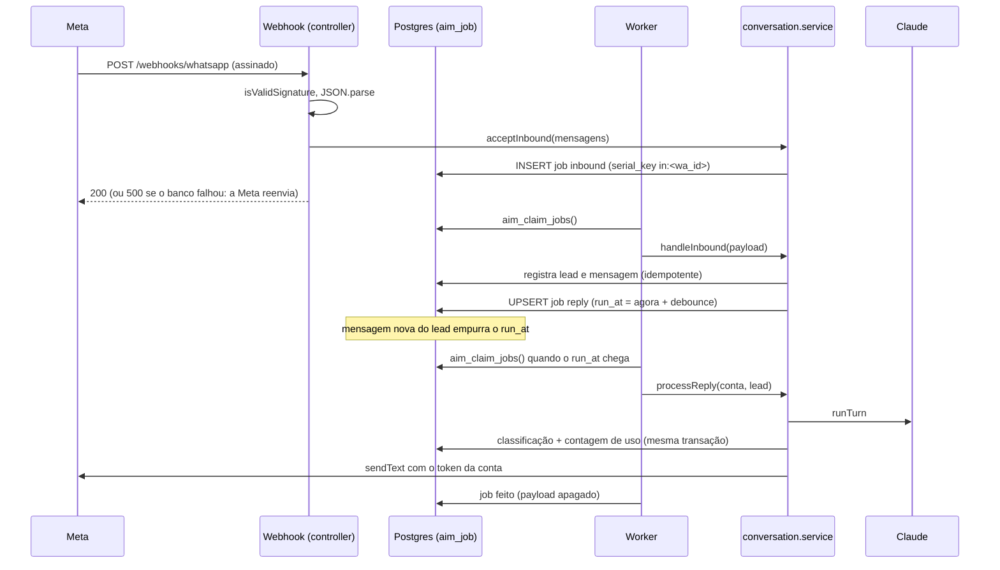
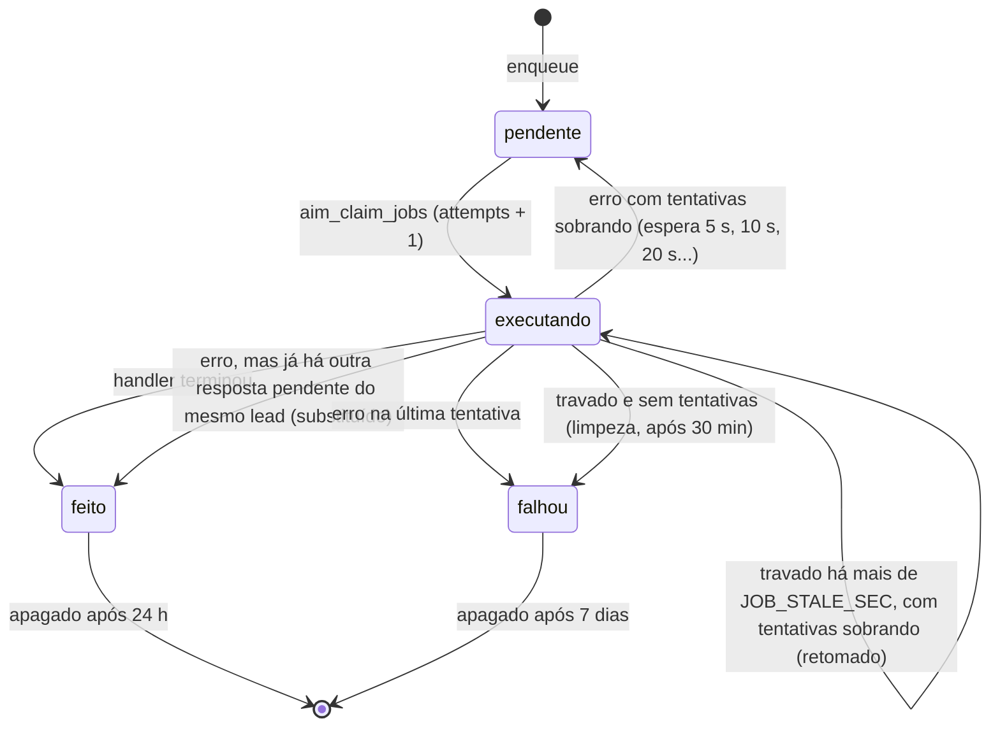

# Fila de jobs, token por conta e uso mensal: lógica, integridade e fluxo

Fonte analisada: `src/db/migrations/0003_fila_jobs.js`, `0004_token_whatsapp_por_conta.js`, `0005_uso_mensal.js`, `src/services/job.service.js`, `src/jobs/worker.js`, `src/services/conversation.service.js`, `src/controllers/index.js`, `src/services/crypto.js`, `src/services/whatsapp/client.js`, `src/services/usage.service.js`, `src/services/notification.service.js`, `src/db/set-wa-token.js` · Gerado em: 25/09/2026

Fase 0 do plano em `docs/plano/melhorias-produto-simples.md`.

## 1. Propósito

Três fundações para o sistema atender várias contas:

1. **Fila de jobs no banco.** A mensagem do webhook é gravada antes do 200 para a Meta, e o processamento (IA e envio) roda num worker. O debounce e a regra de "uma resposta por vez por lead" deixam de ficar na memória do processo. Assim o sistema aguenta várias instâncias, reinício e falhas temporárias.
2. **Token do WhatsApp por conta.** Cada conta pode ter o próprio token, guardado cifrado. Sem ele, vale o token global do `.env`.
3. **Uso mensal por conta.** Conta conversas, chamadas à IA, templates e textos de anúncio por mês. Base dos limites por plano.

## 2. Fluxo

### Sequência de uma mensagem

### Estados de um job (`aim_job.status`)

## 3. Passo a passo

### Passo 1: `webhook.receive` (`src/controllers/index.js:151`)
- **Entrada:** corpo bruto da Meta e o header `x-hub-signature-256`.
- **Lógica:** assinatura inválida responde 401. JSON inválido responde 400. Senão chama `acceptInbound(parseWebhook(payload))`. Se isso lançar erro, responde **500**, para a Meta reenviar. Se não, responde 200.
- **Mudança:** antes o 200 saía antes de gravar qualquer coisa, e uma queda do processo nesse intervalo perdia a mensagem.
- **🧪 Teste:** integração › "banco fora do ar no webhook = 500 (a Meta reenvia)" e "assinatura inválida = 401 e nada é gravado".

### Passo 2: `acceptInbound(messages)` (`src/services/conversation.service.js:138`)
- **Lógica:** para cada mensagem, busca a conta ativa pelo `phone_number_id`, com cache por chamada. Número desconhecido gera aviso no log e é ignorado. Para os demais, chama `enqueueInbound`.
- **Saída:** quantas mensagens foram enfileiradas.
- **Invariante:** cada job pertence à conta dona do número que recebeu a mensagem.
- **Uso:** webhook e simulador do painel (`dev.inbound`). O simulador passa pelo mesmo caminho.

### Passo 3: `enqueueInbound` e `enqueueReply` (`src/services/job.service.js:42`, `:62`)
- **enqueueInbound:** `INSERT` com `kind = 'inbound'`, `serial_key = 'in:<wa_id>'` e a mensagem normalizada no `payload`. Avisa o worker local pelo evento `enqueued`.
- **enqueueReply:** `INSERT` com `kind = 'reply'`, `serial_key = 'reply:<lead_id>'` e `run_at = now() + delay`. O índice único parcial `aim_job_reply_pendente_uq` permite uma só resposta pendente por lead.
  - modo `debounce`, usado a cada mensagem nova: em conflito, `run_at` passa a ser o novo horário. Três mensagens seguidas geram uma resposta, 4 s depois da última.
  - modo `recover`, usado pelo job de recuperação: em conflito, não mexe.
- **Caso-limite:** se a resposta pendente estiver sendo reivindicada no mesmo instante, o upsert espera o lock. Como ela passa a `executando` e sai do índice, o upsert insere uma resposta nova. Essa roda depois da atual por causa da `serial_key`.

### Passo 4: `aim_claim_jobs(p_limit, p_stale_sec)` (`src/db/migrations/0003_fila_jobs.js:75`)
- **Por que função:** o worker atende todas as contas, mas o role `aim_app` só enxerga a conta em `app.tenant_id`. A função é `SECURITY DEFINER`, dona do role de migração, e a policy `aim_job_worker` vale só para esse role. Ela devolve apenas `id`, `tenant_id` e `kind`.
- **Lógica, em ordem:**
  1. `stale_before = now() - max(p_stale_sec, 30 s)`.
  2. **Abertos:** jobs `pendente`, ou `executando` com `locked_at < stale_before` e `attempts < max_attempts`.
  3. **Cabeça de cada chave:** por `(tenant_id, serial_key)`, o aberto mais antigo por `created_at`. Job sem chave é a própria cabeça.
  4. **Elegíveis:** a cabeça roda se estiver travada ou se `run_at <= now()`, e se nenhum outro job da mesma chave estiver executando dentro do prazo.
  5. Até `min(p_limit, 100)` elegíveis, com `FOR UPDATE SKIP LOCKED`, passam a `executando`, com `locked_at = now()` e `attempts + 1`.
- **Invariantes:**
  - dois jobs da mesma chave nunca executam ao mesmo tempo;
  - dentro de uma chave, a ordem é a de criação, mesmo quando o mais antigo está esperando nova tentativa;
  - dois workers nunca pegam o mesmo job.
- **🧪 Teste:** integração › "fila: ordem estrita por contato, sem retomar job travado sem tentativas".

### Passo 5: worker (`src/jobs/worker.js:33`)
- **Ciclo:** a cada `JOB_POLL_MS`, ou quando chega o evento `enqueued`, pede `JOB_CONCURRENCY - em_andamento` jobs. Cada job roda sem esperar os outros. Ao terminar, dispara novo ciclo.
- **runJob:** `load` lê o conteúdo no contexto da conta. Se voltar vazio, outro processo já fechou o job. Em seguida chama o handler e `complete`. Em erro, chama `fail`.
- **Handlers:**
  - `inbound` chama `handleInbound(payload)`;
  - `reply` carrega a conta e, se estiver ativa, chama `processReply(conta, lead_id)`. Conta desativada descarta o job.
- **stop:** para de reivindicar e espera os jobs em andamento, até 8 s. O que não terminar volta à fila depois de `JOB_STALE_SEC`.
- **Limpeza:** a cada 10 min chama `aim_purge_jobs(24, 168)`.
- **🧪 Teste:** `tests/worker.test.js`, com 8 casos: concorrência, falha, tipo desconhecido, conta desativada, stop e falha ao reivindicar.

### Passo 6: `complete` e `fail` (`src/services/job.service.js:101`, `:116`)
- **complete:** status `feito` e `payload = {}`. O texto do lead não fica na fila depois de processado.
- **fail**, com o job travado `FOR UPDATE`:
  1. se `attempts >= max_attempts`, vira `falhou`;
  2. senão, se for `reply` e já houver outra resposta pendente do lead, vira `feito` com `[substituído]`, porque a pendente cobre as mesmas mensagens;
  3. senão, volta a `pendente` com `run_at = now() + retryDelayMs(attempts)`.
- **Fórmula:** `retryDelayMs(n) = min(5000 × 2^(n−1), 600000)` ms, ou seja 5 s, 10 s, 20 s, 40 s, 80 s.
- **last_error:** só o código do erro, via `errorLabel`. Nunca a mensagem, que pode conter telefone ou texto do lead.
- **🧪 Teste:** `fundacao.test.js` › "fila de jobs: regras puras"; integração › "falha no envio do WhatsApp desfaz respondido e a nova tentativa responde".

### Passo 7: `processReply` com contagem de uso (`src/services/conversation.service.js:178`, `:236`)
- Igual ao Passo 6 de `atendimento-whatsapp.md`, com duas diferenças:
  - não há mais debounce em memória: quem garante uma rodada por vez por lead é a `serial_key`;
  - logo após travar o lead na transação C, `usage.countAiTurn` conta a chamada à IA, antes de checar se o humano assumiu. A chamada já aconteceu e custou.
- Erro da IA ou do envio sobe para o worker, que agenda nova tentativa. Antes disso, só o job de recuperação tentava de novo, a cada 5 min.

### Passo 8: `countAiTurn` e `add` (`src/services/usage.service.js:51`, `:30`)
- **Mês:** `date_trunc('month', now() AT TIME ZONE 'America/Sao_Paulo')::date`, calculado pelo banco. Dentro da mesma transação `now()` não muda, então o lead e o contador usam o mesmo mês.
- **countAiTurn:** `UPDATE aim_lead SET usage_month = mês WHERE id = lead AND usage_month IS DISTINCT FROM mês`. Se atualizou uma linha, é conversa nova no mês. Depois soma `conversations + (nova ? 1 : 0)` e `ai_calls + 1`.
- **add:** upsert com `ON CONFLICT (tenant_id, month) DO UPDATE SET campo = campo + incremento`, atômico sob concorrência. `normalizeDelta` recusa negativo, fracionário, texto e contador desconhecido.
- **Templates:** `notifyHandoff` soma `templates_sent + 1` depois de um envio bem-sucedido. Falha ao contar só gera log e não afeta o aviso.
- **Exemplo:** um lead manda mensagens em três rodadas no mesmo mês, e um envio falha e é repetido. Resultado: `conversations = 1` e `ai_calls = 4`.
- **🧪 Teste:** integração › "uso do mês: uma conversa e uma chamada à IA para o lead atendido"; `fundacao.test.js` › "contadores de uso".

### Passo 9: `encrypt` e `decrypt` (`src/services/crypto.js:25`, `:35`)
- **Algoritmo:** AES-256-GCM, IV aleatório de 12 bytes, chave `WA_TOKEN_ENC_KEY` com 64 caracteres hex.
- **Formato:** `v1.<iv>.<tag>.<cifra>`, em base64url.
- **Dado autenticado:** o id da conta. A mesma cifra copiada para outra conta falha na verificação.
- **Erros:**
  - `CRYPTO_KEY_MISSING`: chave ausente ou inválida;
  - `CRYPTO_INVALID_FORMAT`: texto não está no formato `v1`;
  - `CRYPTO_DECRYPT_FAILED`: chave errada, cifra adulterada ou conta errada. O detalhe do erro não é repassado.
- **🧪 Teste:** `fundacao.test.js` › "criptografia do token", com 5 casos.

### Passo 10: `accessTokenFor` e `callGraph` (`src/services/whatsapp/client.js:15`, `:22`)
- **Ordem:** com `WA_MOCK` não chama a Meta. Conta sem `wa_phone_number_id` gera `WA_NOT_CONFIGURED` (409). O token é o da conta, se existir; senão o `WA_ACCESS_TOKEN` global; senão `WA_NOT_CONFIGURED`.
- **Contrato novo:** `sendText(conta, para, texto)` e `sendTemplate(conta, para, nome, idioma, variáveis)`. O primeiro argumento deixou de ser o `phone_number_id` e passou a ser a conta.
- **🧪 Teste:** `fundacao.test.js` › "token do WhatsApp por conta", com 4 casos, incluindo o `toJSON` que esconde o token.

### Passo 11: `set-wa-token.js` (`npm run tenant:wa-token`)
- Grava o token de uma conta com o role de migração, já que `aim_app` só lê `aim_tenant`. O token vem da variável `WA_TOKEN_NEW`, não de argumento, e nunca é impresso. A cifra é conferida antes de gravar. `--clear` remove o token e `--waba` grava o id da WABA.
- Ferramenta de operação até existir a conexão pelo painel, prevista no item 1.2 do plano.

## 4. Integridade das partes

### Contratos

| Produz | Consome | Formato | Quebra se… |
|---|---|---|---|
| `parseWebhook` | `acceptInbound` e `payload` do job inbound | `{ phoneNumberId, waMessageId, waId, name, type, text, timestamp, referralSource }` | renomear campo: `registerInbound` lê do JSON do job |
| `aim_claim_jobs` | `job.service.claim` e worker | `{ id, tenantId, kind }` | adicionar `kind` sem handler: o job falha com `JOB_UNKNOWN_KIND` |
| `job.service.load` | handlers do worker | `{ leadId, payload, attempts, maxAttempts }` | `reply` sem `lead_id`, barrado pela constraint `aim_job_reply_lead_ck` |
| Conta (model `Tenant`) | `whatsapp/client` | `{ id, waPhoneNumberId, waAccessTokenEnc? }` | objeto de conta sem `id`: a cifra da conta não decifra |
| `usage.add` | limites do item 1.4 | linha de `aim_usage_month` por conta e mês | mudar o fuso do mês sem migrar os dados |

### Invariantes globais
- Toda tabela nova com `tenant_id` tem RLS FORCE: `aim_job` e `aim_usage_month`.
- Só o role de migração enxerga jobs de todas as contas, e apenas pelas funções `aim_claim_jobs` e `aim_purge_jobs`.
- Nenhuma chamada de rede acontece dentro de transação de banco.
- O token decifrado nunca vai para log, serializer ou `toJSON`.
- `payload` de job concluído fica vazio. Jobs `feito` somem em 24 h e jobs `falhou` em 7 dias.

### Matriz de impacto

| Mudança | Revalidar |
|---|---|
| Novo `kind` de job | `CHECK` da tabela, `handlers` do worker, `serial_key` escolhida |
| Formato da mensagem normalizada | jobs inbound já gravados, que ainda terão o formato antigo |
| `WA_TOKEN_ENC_KEY` | todos os tokens gravados, que precisam ser gravados de novo |
| Assinatura de `sendText` e `sendTemplate` | `conversation.service`, `notification.service` e mocks dos testes |
| Fuso do mês de uso | `usage.service`, `aim_lead.usage_month` e relatórios |

## 5. Plano de teste

| Passo | Nível | Cenário | Esperado |
|---|---|---|---|
| Webhook | sistema | `acceptInbound` lança erro | 500 e nenhum 200 |
| Webhook | sistema | reenvio do mesmo `wamid` | dois jobs, uma mensagem gravada |
| Debounce | sistema | três mensagens seguidas | uma chamada à IA com as três no histórico |
| Claim | concorrência | 1ª mensagem esperando nova tentativa e 2ª pronta | a 2ª não é reivindicada |
| Claim | valor-limite | travado com `attempts = max` | não é retomado; a limpeza marca `falhou` |
| fail | lógica | reply com outra pendente do mesmo lead | `feito [substituído]` |
| retryDelayMs | lógica | tentativas 0, 1, 2, 3, 4 e 10 | 5 s, 5 s, 10 s, 20 s, 40 s e 10 min |
| Worker | sistema com mocks | handler lento com concorrência 2 | não pede mais jobs à fila até liberar |
| Uso | sistema | lead atendido uma vez | `conversations = 1`, `ai_calls = 1` |
| Cifra | segurança | cifra da conta A lida como conta B | `CRYPTO_DECRYPT_FAILED` |

Os testes de integração rodam contra um Postgres de teste: `TEST_DB=1 npm test`, com o banco migrado e com seed. A conexão de migração usada pelos testes precisa ignorar o RLS, como o superusuário do container, porque os testes leem as tabelas diretamente.

## 6. Pontos em aberto
- **Resposta perdida após transferência com falha de envio.** Já existia antes da fila. Se a IA transfere o lead e o envio da resposta falha, a nova tentativa encontra o lead `transferido` e não reenvia. O corretor é avisado, mas o lead não recebe a última mensagem da assistente.
- **Resposta à mensagem de opt-out.** Se o envio da confirmação de SAIR falhar, a nova tentativa vê a mensagem já registrada e não reenvia. O opt-out em si fica gravado.
- **Simulador do painel é assíncrono.** A mensagem simulada aparece em até `JOB_POLL_MS` depois do 202, e não mais na hora.
- **Follow-up ainda envia direto.** O job de follow-up usa a reivindicação atômica que já tinha e não passa pela fila. Pode migrar quando entrarem os templates da fase 3.
- **Latência extra.** A resposta sai entre `REPLY_DEBOUNCE_MS` e `REPLY_DEBOUNCE_MS + JOB_POLL_MS` depois da última mensagem, de 4 a 5 s com os valores padrão.
- **Custo de busca.** Cada instância consulta a fila a cada `JOB_POLL_MS`, 1 s por padrão. Com muitas instâncias, aumentar o intervalo. O aviso `enqueued` mantém a latência baixa na instância que recebeu o webhook.
