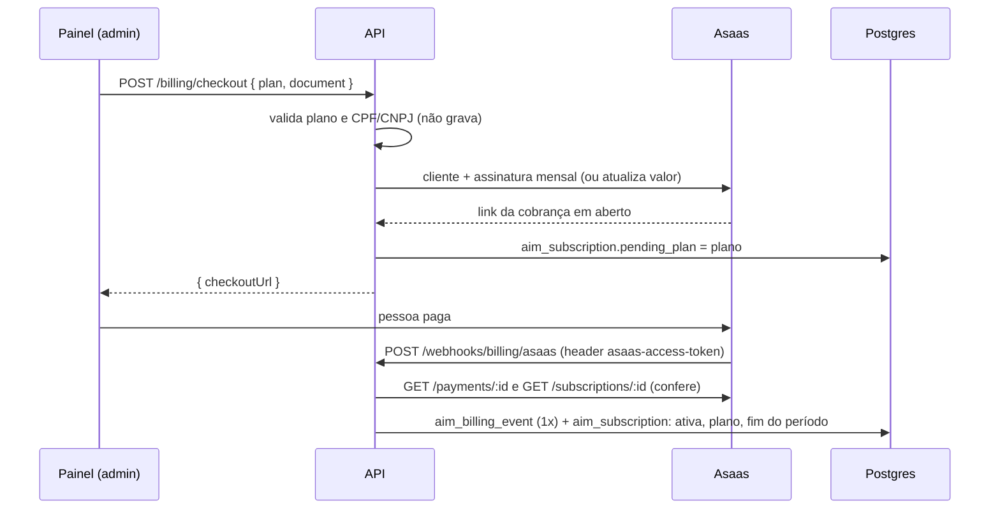
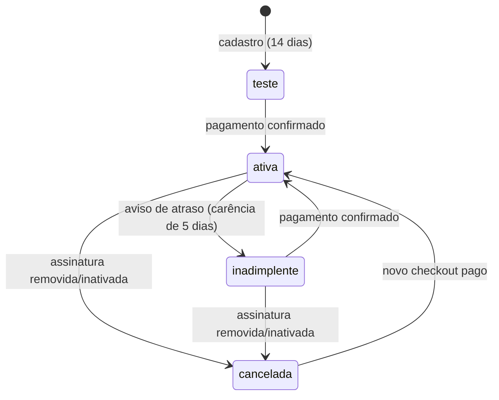

# Planos, cobrança e limites de uso: lógica, integridade e fluxo

Fonte analisada: `src/db/migrations/0007_planos_assinatura.js`, `src/config/plans.js`, `src/services/billing.service.js`, `src/services/billing/entitlement.js`, `src/services/billing/document.js`, `src/services/billing/asaas.js`, `src/services/conversation.service.js` (`conversationGate`, `handoffWithoutAi`), `src/services/property.service.js`, `public/painel/app.js` (Plano e uso) · Gerado em: 25/09/2026

Itens 1.3 e 1.4 do plano em `docs/plano/melhorias-produto-simples.md`.

> ⚠️ **Preços e limites em `src/config/plans.js` são provisórios.** Definir com base no custo medido em `aim_usage_month` antes de vender.

## 1. Propósito

1. Toda conta nova começa com 14 dias de teste grátis.
2. O admin escolhe um plano e paga pelo Asaas, com PIX, boleto ou cartão.
3. O Asaas avisa pagamento, atraso e cancelamento, e a assinatura muda sozinha.
4. Sem direito a conversa nova, a IA não é chamada: o lead recebe uma mensagem fixa e vai para o corretor. Conversa que já estava em andamento no mês nunca é cortada.
5. O painel mostra o plano, o uso do mês e avisa a partir de 80% do limite.

## 2. Fluxo

### Situação da assinatura

## 3. Passo a passo

### Passo 1: direito de uso, `entitlement(sub, now)` (`src/services/billing/entitlement.js`)
Função pura. A conta atende se:

| Situação | Atende enquanto | Motivo quando para | Aviso |
|---|---|---|---|
| sem linha | sempre (plano interno) | - | - |
| `teste` | `now <= trial_ends_at` | `teste_expirado` | `teste_acabando` nos 3 dias finais |
| `ativa` | sempre | - | - |
| `inadimplente` | `now <= grace_until` | `pagamento_atrasado` | sempre |
| `cancelada` | `now <= current_period_end` | `assinatura_cancelada` | enquanto vale |
| plano ou situação desconhecidos | nunca | `plano_desconhecido` ou `situacao_desconhecida` | - |

- **canStartConversation(ent, usadas):** sem direito, devolve o motivo da assinatura. Com direito e `usadas >= limite`, devolve `limite_de_conversas`. Limite `null` é sem limite.
- **usagePercent(usado, limite):** `floor(usado / limite × 100)`, com teto em 100. Chega a 100 só no limite, então 149 de 150 é 99%.
- **🧪 Teste:** `tests/planos.test.js` › "direito de uso" e "limites".

### Passo 2: trava de conversa nova, `conversationGate` (`src/services/billing.service.js`) e `handoffWithoutAi` (`conversation.service.js`)
- **Onde roda:** dentro da transação A de `processReply`, antes de montar o histórico e chamar a IA.
- **Regra:**
  1. se o lead já foi contado como conversa neste mês (`aim_lead.usage_month` igual ao mês atual), segue, sem olhar plano nem limite;
  2. senão, aplica `canStartConversation` com a assinatura e as conversas usadas no mês.
- **Barrado:** `handoffWithoutAi`, em transação com o lead travado:
  - `status = transferido`, `bot_active = false` e `handoff_reason = "plano:<motivo>"`;
  - o resumo para o corretor sai de `describeQualification`;
  - resposta fixa `BLOCKED_REPLY`, mais o aviso de privacidade se for a primeira mensagem.
  - Depois, `deliver` envia e avisa o dono. Uma falha no envio desfaz a marcação de respondido, como no fluxo normal.
- **Não conta uso:** sem IA, nada entra em `aim_usage_month`.
- **🧪 Teste:** integração › "teste vencido: lead novo vai para o corretor sem chamar a IA" e "limite do mês: conversa nova para; conversa já contada no mês continua".

### Passo 3: limite de imóveis, `assertCanActivateProperty` (`billing.service.js`)
- **Onde roda:** em `property.service.create`, quando o imóvel nasce ativo, e em `update`, quando passa de inativo para ativo.
- **Regra:** `ativos >= limite` gera 403 `PLAN_LIMIT`. Imóvel inativo não conta.
- **🧪 Teste:** integração › "limite de imóveis ativos do plano".

### Passo 4: `startCheckout(tenantId, userId, { plan, document })`
- **Validações:**
  - o plano precisa estar à venda (`PURCHASABLE`), ou dá 422;
  - CPF ou CNPJ com dígitos verificadores válidos (`normalizeDocument`), ou dá 422;
  - o e-mail do admin precisa estar confirmado, ou dá 409;
  - a rota exige o papel admin.
- **Provedor simulado:** só fora de produção. Grava `pending_plan` com uma assinatura `mock-…`, sem link de pagamento.
- **Asaas:** `createCheckout` fora de transação.
  - Cria o cliente com nome da conta, e-mail do admin, CPF/CNPJ e `externalReference = id da conta`.
  - Cria a assinatura mensal com `billingType UNDEFINED`, para a pessoa escolher PIX, boleto ou cartão, e vencimento hoje.
  - Se a assinatura já existe, só muda valor e descrição, com `updatePendingPayments`.
  - Devolve o `invoiceUrl` da cobrança pendente.
- **Grava:** upsert em `aim_subscription` com o provedor, os ids e `pending_plan`. A situação não muda até o pagamento. Conta sem linha entra como `interno`/`ativa`, para não ficar sem atender enquanto paga.
- **LGPD:** o CPF/CNPJ não é gravado nem logado. O teste confere que ele não aparece na linha da assinatura.
- **🧪 Teste:** integração › "checkout: valida plano e CPF/CNPJ; CPF não é gravado" e "corretor (não admin) não contrata plano".

### Passo 5: `handleAsaasWebhook(token, body)` e `applyEvent`
1. Com o provedor diferente de `asaas`, responde 404.
2. Compara o token do header `asaas-access-token` com `ASAAS_WEBHOOK_TOKEN` em tempo constante, e exige pelo menos 16 caracteres. Diferente, responde 401.
3. Só trata `PAYMENT_CONFIRMED`, `PAYMENT_RECEIVED`, `PAYMENT_OVERDUE`, `SUBSCRIPTION_DELETED` e `SUBSCRIPTION_INACTIVATED`. Os demais respondem 200 `ignored`.
4. **Não confia no corpo.** Busca o pagamento e a assinatura na API do Asaas.
   - Pago só se o status real for `CONFIRMED`, `RECEIVED` ou `RECEIVED_IN_CASH`.
   - Atraso só se o status real for `OVERDUE`.
   - Cancelada se a assinatura foi removida ou não está `ACTIVE`.
   - A conta vem do `externalReference` da assinatura.
5. **applyEvent**, numa transação da conta:
   - `INSERT aim_billing_event ON CONFLICT DO NOTHING`; se já existia, devolve `duplicate`;
   - trava a assinatura e exige que o provedor e o id da assinatura sejam os desta conta; senão devolve `ignored`;
   - **pago:** `ativa`, `plan = pending_plan`, e `current_period_end` vai até o fim do dia do próximo vencimento em São Paulo, ou agora + 1 mês;
   - **atraso:** `inadimplente`, e `grace_until = agora + 5 dias`. Um segundo aviso de atraso não estende a carência;
   - **cancelada:** `cancelada`. O período já pago continua valendo.
- **🧪 Teste:** integração › "aviso do Asaas: token, conferência na API, idempotência e assinatura de outra conta" e "pagamento, atraso e cancelamento mudam a assinatura".

### Passo 6: painel, tela "Plano e uso"
- **Situação:** uma frase gerada por `situacaoPlano`, igual no aviso do topo e na tela.
- **Cartões de uso:** conversas no mês e imóveis ativos, no formato "X de Y" com percentual, mais respostas da assistente e templates enviados.
- **Planos:** preço, limites e o botão "Escolher" para o admin. O plano atual aparece marcado, inclusive com pagamento atrasado, e o plano cancelado ganha "Reativar".
- **Checkout:** pede o CPF ou CNPJ e redireciona para a página de pagamento do Asaas. No modo local aparecem botões que simulam pagamento, atraso e cancelamento.
- **Aviso no topo:** situação ruim, uso a partir de 80% ou limite esgotado.

## 4. Integridade das partes

### Contratos

| Produz | Consome | Formato | Quebra se… |
|---|---|---|---|
| `config/plans.js` | entitlement, overview e painel | `{ name, priceCents, purchasable, limits: { conversations, properties, users, templates } }` | faltar um limite: o teste "todo plano tem os quatro limites" pega |
| `billing.overview` | painel | `{ subscription, limits, usage, percent, plans, billing }` | renomear `daysLeft`, `graceUntil` ou `pendingPlan`: textos do painel |
| Asaas `externalReference` | `applyEvent` | id da conta (uuid) | criar assinatura no Asaas por fora do sistema: o aviso é ignorado |
| `handoff_reason` | painel, ficha do lead | `plano:<motivo>` | - |

### Invariantes globais
- `aim_subscription` tem RLS FORCE por conta. `aim_billing_event` não tem `tenant_id` nem conteúdo, só o id do aviso.
- Conversa já contada no mês nunca é interrompida pela trava.
- Nenhum CPF/CNPJ fica no banco ou no log.
- Um aviso do provedor é aplicado no máximo uma vez.
- Só vale aviso da assinatura que a própria conta criou.

### Matriz de impacto

| Mudança | Revalidar |
|---|---|
| Preço de um plano | assinaturas existentes só mudam no próximo checkout |
| Novo plano | `PLANS`, `PURCHASABLE` e o CHECK de `plan` (`^[a-z_]{3,30}$`) |
| Dias de teste ou de carência | textos do painel, que calculam pelos campos de data |
| Novo evento do Asaas | `RELEVANT` e o mapeamento para `kind` |

## 5. Plano de teste

| Passo | Nível | Cenário | Esperado |
|---|---|---|---|
| entitlement | lógica | teste no instante exato do fim | ainda atende |
| entitlement | lógica | atrasado sem `grace_until` | não atende |
| gate | produto | teste vencido e lead novo | transferido, sem IA, sem uso contado, mensagem fixa com aviso de privacidade |
| gate | produto | limite atingido e lead já contado no mês | IA responde, uso não conta de novo |
| imóveis | produto | ativar um acima do limite, criando ou reativando | 403 `PLAN_LIMIT` |
| checkout | validação | plano interno, CPF inválido ou corretor | 422, 422 e 403 |
| webhook | segurança | token errado | 401 |
| webhook | segurança | corpo diz `RECEIVED` e a API diz `OVERDUE` | vale a API |
| webhook | idempotência | mesmo `id` duas vezes | `applied` e depois `duplicate` |
| webhook | segurança | assinatura de outra conta | `ignored`, sem mudança |

## 6. Pontos em aberto
- **Asaas não testado de verdade.** O cliente foi escrito pela documentação da API v3. Antes de vender, rodar o fluxo no sandbox: `ASAAS_BASE_URL` de sandbox, chave de sandbox, webhook apontando para o túnel e um pagamento de teste.
- **Limite é aproximado sob concorrência.** Dois leads novos chegando juntos quando falta uma conversa podem passar os dois. O excesso máximo é o número de respostas simultâneas, até `JOB_CONCURRENCY` por instância.
- **Aviso ao dono por lead barrado.** Cada lead transferido pela trava gera um alerta, se o template estiver configurado. Com muitos leads num dia, pode ser melhor um aviso só, no resumo diário do item 2.1.
- **Cancelar pelo painel.** Ainda não existe botão. O cancelamento é feito no Asaas e chega pelo aviso.
- **Limite de usuários e de templates.** Estão nos planos, mas ainda não são aplicados. Não existe tela de convite de usuários, e os templates pagos entram na fase 3.
- **Planos com preço provisório.** Ver o aviso no topo deste documento.
