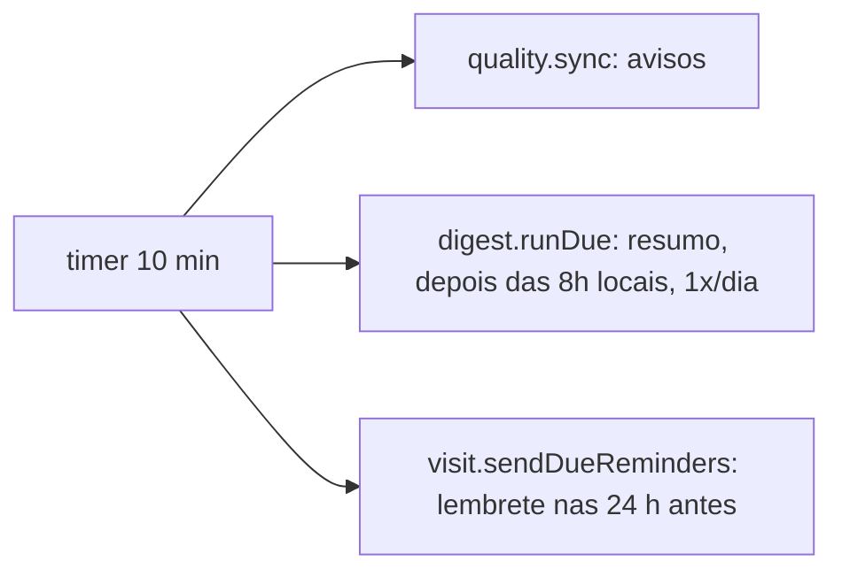
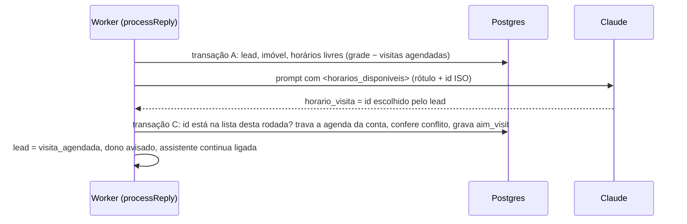

# Rotina do dono: avisos, resumo diário e agenda de visitas: lógica, integridade e fluxo

Fonte analisada: `src/db/migrations/0010_rotina_do_dono.js`, `src/services/quality.service.js`, `src/services/digest.service.js`, `src/services/visit.service.js`, `src/services/visit/slots.js`, `src/services/time.js`, `src/services/conversation.service.js` (transação C), `src/services/ai/prompt.js` e `claude.client.js` (`horario_visita`), `src/jobs/routines.job.js`, `public/painel/app.js` (Hoje, Agenda, ficha, Conta) · Gerado em: 25/09/2026

Fase 2 do plano em `docs/plano/melhorias-produto-simples.md`: itens 2.1, 2.2 e 2.3.

## 1. Propósito

Dar ao dono, sem planilha e sem IA extra, três coisas:

1. **Hoje:** o que precisa de atenção agora, como lead esperando o corretor, visitas do dia e leads novos. O resumo também sai no WhatsApp às 8h.
2. **Avisos:** problemas detectados por regras fixas, que somem sozinhos quando se resolvem.
3. **Agenda:** a assistente marca a visita num horário livre da grade da conta. O corretor agenda, remarca e conclui pelo painel, e o lead recebe lembrete.

## 2. Fluxo

### Rotinas periódicas (`src/jobs/routines.job.js`, a cada 10 min, por conta ativa)

A tela "Hoje" (`GET /api/v1/today`) também chama `quality.sync` antes de listar. O que o corretor acabou de resolver já some da tela.

### Visita marcada pela assistente

## 3. Passo a passo

### Passo 1: fuso horário (`src/services/time.js`)
- **Base:** conversão entre a hora local da conta e o instante UTC, usando `Intl.DateTimeFormat`, sem biblioteca.
- **zonedToUtc:** faz duas passadas, então funciona na troca de horário de verão em fusos que ainda têm.
- **Fuso da conta:** `aim_tenant.timezone`, com padrão `America/Sao_Paulo`. É validado por `isValidTimezone`, e o painel oferece os fusos do Brasil.
- **🧪 Teste:** `tests/rotina.test.js` › "fuso horário". Cobre São Paulo e Manaus, a virada do dia local e o rótulo "qua 30/09 às 10:00".

### Passo 2: horários livres (`src/services/visit/slots.js`)
- **parseSchedule:** a duração da visita é 30, 45, 60, 90 ou 120 minutos. Cada dia de 0 a 6 aceita até 4 faixas `HH:MM-HH:MM`, sem sobreposição e cada uma pelo menos do tamanho da visita.
- **freeSlots:** para cada dia de calendário local de hoje até `days − 1`, e para cada faixa, gera inícios a cada `slotMinutes` enquanto `início + duração <= fim da faixa`. Descarta o início anterior a `agora + antecedência`, que é 120 min para a IA e 60 min no painel. Descarta também o que se sobrepõe a qualquer visita agendada da conta, com a regra `início < fim ocupado` e `início ocupado < fim`.
- **pickOffer:** por dia, escolhe o primeiro horário da manhã e o primeiro da tarde, completando até 2 por dia e até 6 no total.
- **🧪 Teste:** `rotina.test.js` › "grade de visitas", com 5 casos: antecedência, dia sem grade, ocupação parcial e oferta espalhada.

### Passo 3: agendamento pela IA (`conversation.service.processReply` e `visit.service.bookInTx`)
- **Transação A:** com imóvel definido e lead que não está `frio`, calcula até 6 horários livres. Eles vão para o prompt como `rótulo (id: ISO)`.
- **Prompt:** com horários, a IA oferece 2 ou 3, e quando o lead escolhe, preenche `horario_visita` com o id exato. Sem horários, vale a regra clássica: registrar a preferência e transferir para o corretor.
- **Transação C:**
  1. `horario_visita` só vale se estiver na lista desta rodada. Senão é ignorado, e a IA não consegue inventar um horário.
  2. `bookInTx` pega uma trava por conta, `pg_advisory_xact_lock(hashtext('aim_visit:' || conta))`, e recusa se outra visita agendada da conta se sobrepõe. A agenda é única por conta.
  3. Se o lead já tem visita agendada, ela é **remarcada**, e não duplicada.
  4. **Marcada:** `status = visita_agendada`, `visit_preference` com o rótulo, `handoff_reason = visita_agendada` e resumo para o corretor. O dono é avisado, e `bot_active` continua `true`, para a assistente seguir tirando dúvidas.
  5. **Ocupada no meio do caminho:** a resposta ganha "esse horário acabou de ser reservado…" e o lead vai para o corretor com `horario_ocupado`.
- **Regra de transferência automática:** "lead quente com preferência de visita vai para o corretor" agora vale só **quando não há horários para oferecer** e o lead ainda não tem visita marcada.
- **🧪 Teste:** integração › "agenda de visitas" › "a IA oferece horários livres e marca o que o lead escolheu" e "horário fora da lista oferecida é ignorado".

### Passo 4: agenda pelo painel (`visit.service.create`, `update`, `list`, `freeSlotsFor`)
- **Criar:** qualquer usuário da conta pode agendar para um lead que não foi excluído nem pediu SAIR. O horário precisa ser futuro, sem conflito, e pode ficar fora da grade. O lead passa a `visita_agendada`.
- **Atualizar:** só visita `agendada`. Muda a situação para `cancelada`, `realizada` ou `nao_compareceu`, ou remarca. A mesma requisição não pode fazer as duas coisas, e isso dá 422. Cancelar devolve o lead a `transferido`. Visita encerrada responde 409.
- **Listar:** de hoje, no fuso da conta, até 14 dias, com o rótulo pronto.
- **🧪 Teste:** integração › "painel: horários livres, agendar, conflito, remarcar e concluir" e "cancelar a visita devolve o lead para o corretor".

### Passo 5: lembrete (`visit.sendDueReminders`)
- **Quais visitas:** as agendadas, sem lembrete, começando entre `agora + 1 h` e `agora + 24 h`, de lead não excluído e sem opt-out.
- **Como envia:** dentro da janela de 24 h do WhatsApp, com margem de 10 min, vai texto livre. Fora dela vai o template `WA_VISIT_REMINDER_TEMPLATE`, que conta no uso. Sem template, fica sem lembrete.
- **Depois do envio:** grava a mensagem como `system` e `reminder_sent_at`. Remarcar zera o lembrete.
- **🧪 Teste:** integração › "lembrete nas 24 h antes: texto livre dentro da janela, uma vez só".

### Passo 6: avisos (`src/services/quality.service.js`)

| Tipo | Origem | Aparece quando | Some quando |
|---|---|---|---|
| `lead_sem_retorno` | regra | transferido, sem mensagem do corretor desde a transferência, há mais de `handoff_sla_minutes` (padrão 120) | o corretor responde, ou o lead muda de situação |
| `sem_resposta` | regra | o lead escreveu, o bot está ligado, e nada saiu entre 15 min e 24 h depois | a assistente responde |
| `cadastro_incompleto` | regra | 3 ou mais leads com dúvida **nova**, pela `open_questions_at`, depois da última edição do imóvel | o imóvel é editado, na hora |
| `falha_envio`, `ia_invalida`, `falha_resposta` | evento | a resposta ao lead esgotou as tentativas na fila, conforme o código do erro | o lead recebe uma mensagem de saída depois do aviso, ou sai do atendimento |

- **sync:** trava os avisos abertos e calcula as condições atuais. `diffAlerts`, uma função pura, decide o que criar e o que resolver. Também atualiza os números dos que continuam abertos, como os minutos esperando.
- **Unicidade:** um aviso aberto por lead e tipo, ou por imóvel e tipo, garantido por índices únicos parciais e `ON CONFLICT DO NOTHING`.
- **details:** só números, códigos e as perguntas já agregadas do cadastro. Nunca texto de conversa.
- **Resolver na mão:** `PATCH /api/v1/alerts/:id`. Se o problema continuar, o aviso volta na próxima rodada.
- **🧪 Teste:** `rotina.test.js` › "avisos de qualidade"; integração › "lead transferido sem retorno…", "cadastro incompleto…" (incluindo o caso de o aviso não voltar sem dúvida nova) e "resposta que esgotou as tentativas…".

### Passo 7: resumo diário (`src/services/digest.service.js`)
- **Números:** calculados pelo banco no fuso da conta.

| Campo | O que conta |
|---|---|
| `aguardando` e `quentesAguardando` | transferidos sem resposta humana, no total e só os quentes |
| `esperaMaisLongaMin` | há quantos minutos espera o transferido mais antigo |
| `novosOntem` e `quentesOntem` | leads criados entre a meia-noite de ontem e a de hoje, no total e só os quentes |
| `visitasHoje` | visitas agendadas para hoje |
| `avisos` | avisos abertos |

- **runDue:**
  1. Desligado (`digest_enabled`) ou antes das 8h locais: não faz nada.
  2. Reivindica o dia com `INSERT aim_digest (conta, dia) ON CONFLICT DO NOTHING` **antes** de enviar, então duas instâncias nunca mandam o mesmo resumo.
  3. Nada relevante: grava `nada_relevante`.
  4. Relevante, com template `WA_DAILY_DIGEST_TEMPLATE` e WhatsApp do dono: envia com 5 variáveis e grava `whatsapp`, que conta no uso. Sem template: grava `so_painel`.
- **Tela "Hoje":** os mesmos números, calculados na hora.
- **🧪 Teste:** integração › "resumo diário: depois das 8h locais, uma vez por dia, desligável".

## 4. Integridade das partes

| Produz | Consome | Formato | Quebra se… |
|---|---|---|---|
| `offerForLead` | prompt e transação C | `{ id: ISO, label }` | mudar o formato do id: a validação `some(s.id === turn.visitSlot)` para de aceitar |
| `bookInTx` | conversa e painel | `{ ok, visit: { id, startsAt, label } }` ou `{ ok: false, reason }` | - |
| `aim_tenant.visit_schedule` | slots, painel e Conta | `{ slotMinutes, days: { "0".."6": [faixas] } }` | gravar sem `setSchedule`: `scheduleOf` devolve null e a oferta some |
| `quality.listOpen` | `serialize.alert` e painel | `{ id, kind, details, lead, property }` | tipo novo sem texto em `AVISO` no painel: aparece o código cru |
| `digest.countsInTx` | painel e template | 7 contadores | mudar a ordem das 5 variáveis sem mudar o template aprovado na Meta |

### Invariantes
- Uma visita agendada por lead, e um horário por imóvel. Os dois são garantidos por índices únicos parciais.
- Duas visitas agendadas da mesma conta nunca se sobrepõem, por causa da trava por conta com a checagem na mesma transação.
- A IA só marca horários que o sistema ofereceu naquela rodada.
- No máximo um resumo por conta por dia local.
- Avisos não guardam texto de conversa.

### Matriz de impacto

| Mudança | Revalidar |
|---|---|
| Agenda por corretor, e não por conta | `bookInTx` com trava e conflito por corretor, `freeSlots` com ocupação por corretor e a tela Agenda |
| Novo tipo de aviso | CHECK de `aim_alert.kind`, `RULE_KINDS` ou `EVENT_KINDS` e `AVISO` no painel |
| Horário do resumo diferente das 8h | `SEND_FROM_HOUR` e o texto do painel |

## 5. Plano de teste

| Passo | Nível | Cenário | Esperado |
|---|---|---|---|
| slots | lógica | sexta 9h30, grade das 9h às 12h | primeira oferta às 14h |
| slots | limite | visita ocupando das 14h30 às 15h30 | 14h e 15h saem, 16h e 17h ficam |
| IA | segurança | a IA devolve um horário fora da lista | ignorado, sem visita |
| painel | concorrência | remarcar para um horário de outra visita | 409 `VISIT_CONFLICT` |
| lembrete | idempotência | rodar duas vezes | 1 envio e depois 0 |
| avisos | produto | corretor responde o lead transferido | aviso resolvido `automatico` |
| avisos | produto | lead segue conversando sem dúvida nova depois da edição do imóvel | aviso não volta |
| resumo | idempotência | 7h30, 8h30 e 9h30 do mesmo dia | `nao_e_hora`, `so_painel` e `ja_enviado` |

## 6. Pontos em aberto
- **Agenda única por conta.** Serve à imobiliária pequena, em que os mesmos corretores fazem todas as visitas. Várias agendas, uma por corretor, entram com a fase 4, junto com o cadastro de vários corretores.
- **Aviso ao lead quando o corretor cancela ou remarca pelo painel.** Não sai automático. O corretor combina direto pela conversa.
- **Templates.** Resumo diário e lembrete fora da janela dependem de templates aprovados na Meta: `WA_DAILY_DIGEST_TEMPLATE`, com 5 variáveis, e `WA_VISIT_REMINDER_TEMPLATE`, com 3. Sem eles, o resumo fica só no painel e o lembrete só sai dentro da janela de 24 h.
- **Resumo que falhou.** Não é reenviado no mesmo dia: o dia fica marcado como `falhou`, e os números seguem na tela "Hoje".
- **Endereço do imóvel.** O prompt tem só o bairro e a cidade (`location_summary`). A confirmação da visita cita o bairro, e o endereço exato fica com o corretor.
